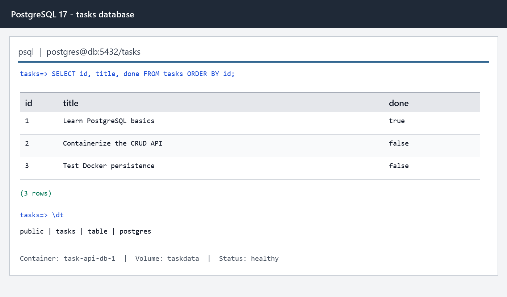

# Task API

A containerized CRUD API built with Python, FastAPI, PostgreSQL, and Docker Compose. The public API has stayed stable across in-memory, SQLite, and PostgreSQL storage implementations.

## Run it

Requires Docker Desktop or another Docker Compose-compatible engine.

```bash
cp .env.example .env
docker compose up --build
```

Open:

- API: http://localhost:8000/
- Swagger UI: http://localhost:8000/docs
- Health check: http://localhost:8000/health

The Compose stack starts two services: `api` and `db`. The API waits for PostgreSQL to become healthy, creates the `tasks` table and index automatically, then seeds three examples only when the table is empty.

Configuration comes from `.env`. Copy `.env.example` and change `POSTGRES_USER`, `POSTGRES_PASSWORD`, and `POSTGRES_DB` when needed. Real credentials belong only in `.env`, which Git and Docker builds ignore.

## Endpoints

| Method | Path | Purpose | Success |
| --- | --- | --- | --- |
| GET | `/` | API information | 200 |
| GET | `/health` | API and database health check | 200 |
| GET | `/tasks` | List alphabetically; optionally filter, search, or paginate | 200 |
| GET | `/tasks/{id}` | Get one task | 200 |
| POST | `/tasks` | Create a task | 201 |
| PUT | `/tasks/{id}` | Update a task's title and/or done state | 200 |
| DELETE | `/tasks/{id}` | Delete a task | 204 |
| GET | `/stats` | Count total, done, and open tasks | 200 |
| POST | `/reset` | Restore example tasks | 200 |

`GET /tasks` accepts `done`, `search`, `limit`, and `offset` query parameters. Filtering, searching, sorting, and statistics are performed by SQL. Pagination matters in real APIs because returning an unlimited collection becomes slow and expensive as data grows.

## PostgreSQL

The database runs from the official `postgres:17-alpine` image. Its named `taskdata` volume lives outside the container, so tasks survive `docker compose down` followed by `docker compose up`.

```sql
CREATE TABLE tasks (
    id SERIAL PRIMARY KEY,
    title TEXT NOT NULL,
    done BOOLEAN NOT NULL DEFAULT FALSE
);
```

Inspect the live database:

```bash
docker compose exec db psql -U postgres -d tasks -c "\dt"
docker compose exec db psql -U postgres -d tasks -c "SELECT * FROM tasks;"
```

The repository module uses psycopg `%s` placeholders for all client-provided values. An index on `done` helps PostgreSQL filter tasks efficiently. Seeding and reset operations use transactions so their multi-row changes are all-or-nothing.



## Example

```console
$ curl -i -X POST http://localhost:8000/tasks \
  -H "Content-Type: application/json" \
  -d '{"title":"Buy milk"}'
HTTP/1.1 201 Created
content-type: application/json

{"id":4,"title":"Buy milk","done":false}
```

Then try the full CRUD cycle in Swagger UI at `/docs`.

## Run the tests

```bash
pip install -r requirements-dev.txt
pytest -q
```

The automated tests cover health, successful CRUD, 404 responses, validation, filtering, search, pagination, statistics, reset, persistence, and seed safety against a real PostgreSQL service in GitHub Actions.

The same endpoint tests used for the in-memory and SQLite versions still pass. Identical behavior across three storage engines proves that storage is an implementation detail; a later layered-architecture step formalizes that boundary.

The `/health` endpoint runs `SELECT 1` against PostgreSQL. A load balancer can use this signal to stop routing traffic to an instance whose database connection is unhealthy.

Without the named volume, deleting the database container would delete its rows. The `taskdata` volume preserves the database independently from any individual container.
