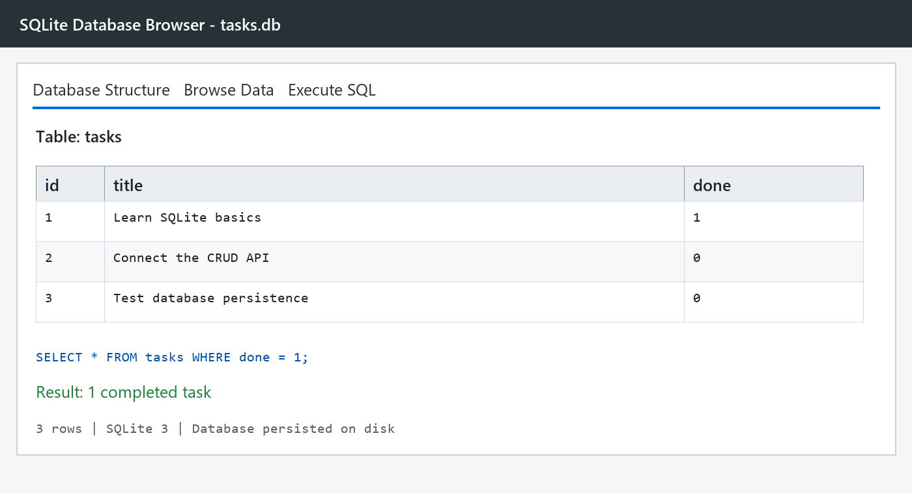

# Task API

A database-backed CRUD API for a to-do list, built with Python, FastAPI, and SQLite. It supports creating, reading, updating, and deleting persistent tasks, with interactive Swagger documentation.

## Run it

Requires Python 3.10 or newer.

```bash
python -m venv .venv
.venv\Scripts\activate

pip install -r requirements.txt
uvicorn app:app --reload
```

Open:

- API: http://localhost:8000/
- Swagger UI: http://localhost:8000/docs
- Health check: http://localhost:8000/health

The app creates `tasks.db` automatically in the project folder and seeds three examples only when the table is empty. SQLite was chosen because it stores the database in one file, requires no separate server or setup, and preserves tasks across application restarts. The database file is ignored by Git so every clean clone starts with a fresh database.

## Endpoints

| Method | Path | Purpose | Success |
| --- | --- | --- | --- |
| GET | `/` | API information | 200 |
| GET | `/health` | Health check | 200 |
| GET | `/tasks` | List alphabetically; optionally filter, search, or paginate | 200 |
| GET | `/tasks/{id}` | Get one task | 200 |
| POST | `/tasks` | Create a task | 201 |
| PUT | `/tasks/{id}` | Update a task's title and/or done state | 200 |
| DELETE | `/tasks/{id}` | Delete a task | 204 |
| GET | `/stats` | Count total, done, and open tasks | 200 |
| POST | `/reset` | Restore example tasks | 200 |

`GET /tasks` accepts `done`, `search`, `limit`, and `offset` query parameters. Filtering, searching, sorting, and statistics are performed by SQL. Pagination matters in real APIs because returning an unlimited collection becomes slow and expensive as data grows.

## SQLite

The schema is created automatically:

```sql
CREATE TABLE tasks (
    id INTEGER PRIMARY KEY AUTOINCREMENT,
    title TEXT NOT NULL,
    done INTEGER NOT NULL DEFAULT 0
);
```

One query explored by hand was:

```sql
SELECT * FROM tasks WHERE done = 1;
```

It returned only completed tasks. The API and database viewer show the same rows because `tasks.db` is their single source of truth.

The app uses parameterized `?` placeholders for all user-provided values. Indexes on `title` and `done` help SQLite locate searched and filtered rows efficiently. Seeding runs inside a transaction so all three examples are inserted together or none are.



## Example

```console
$ curl -i -X POST http://localhost:8000/tasks \
  -H "Content-Type: application/json" \
  -d '{"title":"Buy milk"}'
HTTP/1.1 201 Created
content-type: application/json

{"id":4,"title":"Buy milk","done":false}
```

Then try the full CRUD cycle in Swagger UI at `/docs`.

## Run the tests

```bash
pip install -r requirements-dev.txt
pytest -q
```

The automated tests cover root and health endpoints, successful CRUD, 404 responses, validation, filtering, search, pagination, statistics, reset, persistence, and seed safety. The same endpoint tests used for the in-memory version still pass, proving that storage is an implementation detail: clients see the same API even though data now comes from SQLite.
